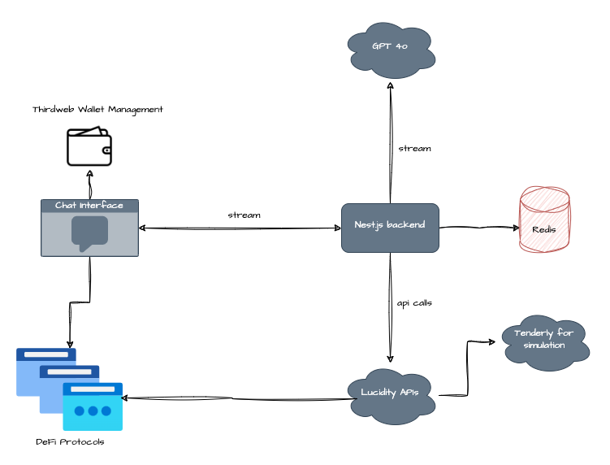
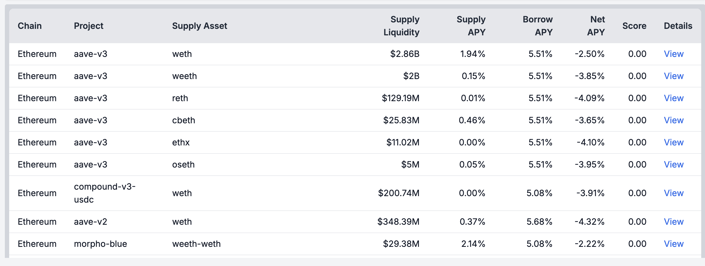

# LuciBot Chatbot Service Documentation

## Overview

LuciBot is a comprehensive DeFi chatbot built using NestJS for the backend, Next.js for the frontend, and OpenAI’s GPT-4 Assistant API. LuciBot interacts with the [Lucidity Finance](https://lucidity.finance/docs) APIs to provide users with real-time DeFi protocol recommendations, protocol actions, and data retrieval through natural language conversations. The system leverages Redis for caching and supports thread-based conversation management to maintain context across user sessions.

## Why LuciBot?

The DeFi space is intricate, with a multitude of protocols and options that can be overwhelming for both new and experienced users. LuciBot is designed to bridge this gap by offering an AI-powered assistant that simplifies complex DeFi operations. By translating natural language queries into actionable financial operations, LuciBot reduces the barriers to entry, allowing users to interact with decentralized finance protocols more confidently and efficiently. This empowers users to make informed decisions without needing deep technical expertise, thus enhancing accessibility and user experience in the DeFi ecosystem.

1. **Discovery and Risk Assessment**: LuciBot provides intelligent recommendations based on real-time data, helping users discover the most suitable DeFi protocols while assessing associated risks.
  
2. **Access to Actionable Real-Time Data**: LuciBot delivers critical, up-to-date information about various DeFi protocols, allowing users to make informed decisions quickly and effectively.
  
3. **Efficient Position Management**: LuciBot enables users to execute transactions and manage their DeFi positions seamlessly, streamlining complex actions into simple, guided steps. 

DeFi is a complex and dynamic space, and LuciBot is designed to help users navigate it.

Talk about the need of UX friendly apps in DeFi?  - Here you go!

## Features

- **AI-Powered**: Uses GPT-4 to interpret user messages and generate relevant requests.
- **Lucidity Integration**: Direct integration with Lucidity Finance APIs for seamless DeFi interactions.
- **Cross-Platform**: Backend powered by NestJS and frontend developed with Next.js.
- **Thread Management**: Utilizes Redis to maintain user conversations across multiple interactions.
- **User-friendly**: Provides a user-friendly interface for interacting with the chatbot.
- **Real-time**: Responds to user queries in real-time.
- **Actionable** :Can execute transactions protocol actions like supply, borrow, withdraw, or repay based on user input.

## Technology Stack

- **NestJS**: Backend framework for creating robust server-side logic.
- **Next.js**: Frontend framework for building dynamic web applications.
- **OpenAI GPT-4**: AI model used to interpret and respond to user queries.
- **Lucidity Finance API**: DeFi protocol interaction and data fetching.
- **Redis**: In-memory data store used for caching and managing user threads.

## Architecture



## Installation

### 1. Clone the Repository

Clone the repository to your local machine:

```bash
git clone https://github.com/lucid-labs/superhack-2024
```

### 2. Install Dependencies

Navigate to the backend and frontend directories and install dependencies:

```bash
# For Backend
cd backend
npm install

# For Interface
cd interface
npm install
```

### 3. Set Up Environment Variables

Create a `.env` file in both the `backend` and `frontend` directories with the following variables:

```plaintext
# Backend .env
OPENAI_API_KEY=your-openai-api-key
ASSISTANT_ID=your-assistant-id
LUCIDITY_BASE_URL=https://api-dev.lucidity.finance
REDIS_URL=redis://localhost:6379

```

### 4. Start the Services

Start both the backend and frontend servers:

```bash
# Backend
cd backend
npm run start:dev

# Frontend
cd interface
npm run dev
```

The backend will run on `http://localhost:3000` and the frontend on `http://localhost:3001`.

## API Usage

### 1. Chatbot Endpoint: POST /chat

Send user messages to LuciBot.

#### Request

```json
{
  "userId": "0x1234567890123456789012345678901234567890", // address of the user
  "message": "I want to supply 10 ETH."
}
```

#### Response

LuciBot will return either a message or an object based on the user’s request.

## Services Overview

### GptAssistantService

Handles interactions with OpenAI GPT-4, managing threads, and interpreting user messages.

#### Key Methodss
- `interpretMessage(userId: string, message: string)`: Interprets user messages and generates a request object.
- `formatResponse(userId: string, data: any)`: Formats data into a user-friendly format.

### LucidityService

Interacts with Lucidity Finance APIs to perform operations based on user requests.

#### Key Methods

- `getProtocolRecommendation(request: RecommendationRequest)`: Fetches protocol recommendations.
- `performProtocolAction(request: ProtocolActionRequest)`: Executes protocol actions like supply, borrow, withdraw, or repay.
- `getProtocolData(request: ProtocolDataRequest)`: Retrieves data related to a specific protocol.
- `getUserData(request: UserDataRequest)`: Retrieves user-specific data from the protocol.

### ChatbotService

Coordinates between the GPT-4 assistant and LucidityService to process and respond to user queries.

#### Key Methods

- `handleUserMessage(userId: string, message: string)`: Main handler for processing user messages.

## Frontend Overview

The frontend is built with Next.js, providing a seamless user interface for interacting with LuciBot.

### Key Components

- **Chat Interface**: A dynamic chat interface for users to interact with LuciBot.
- **API Integration**: Frontend integrates with the backend to send and receive messages.

## Example Scenarios

### Scenario 1: Protocol Recommendation

**User Message**: "Where can I borrow USDC on ethereum mainnet with ETH as a collateral?"

**Backend Request Object**:

```json
{
  "actionType": "recommendation",
  "chainIds": ["1"],
  "supplyAsset": "USDC",
  "borrowAsset": "",
  "borrowAmount": "",
  "isOnlySupply": true,
  "riskRating": "low",
  "parameters": ["supplyApy", "supplyLiquidity"]
}
```

**Response**:


### Scenario 2: Protocol Action (Supply)

**User Message**: "Supply 10 USDC to Aave V2."

**Backend Request Object**:

```json
{
  "actionType": "protocolAction",
  "type": "supply",
  "protocol": "aave-v2",
  "assetSymbol": "USDC",
  "assetAddress": "0xA0b86991c6218b36c1d19D4a2e9Eb0cE3606eB48",
  "chainId": 1,
  "amount": "10000000",
  "userAddress": "0xA0b86991c6218b36c1d19D4a2e9Eb0cE3606eB48",
  "misc": {}
}
```

**Response**:

```json
{
  "type": "supply",
  "protocol": "aave-v2",
  "assetSymbol": "USDC",
  "assetAddress": "0xA0b86991c6218b36c1d19D4a2e9Eb0cE3606eB48",
  "chainId": 1,
  "amount": "10000000",
  "userAddress": "0xA0b86991c6218b36c1d19D4a2e9Eb0cE3606eB48",
  "data": [
    {
      "to": "0xA0b86991c6218b36c1d19D4a2e9Eb0cE3606eB48",
      "data": "0x095ea7b30000000000000000000000007d2768de32b0b80b7a3454c06bdac94a69ddc7a90000000000000000000000000000000000000000000000000000000000989680",
      "value": "0",
      "metadata": "Approve 10.0 USDC to AAVE-V2"
    },
    {
      "to": "0x7d2768dE32b0b80b7a3454c06BdAc94A69DDc7A9",
      "data": "0xe8eda9df000000000000000000000000a0b86991c6218b36c1d19d4a2e9eb0ce3606eb480000000000000000000000000000000000000000000000000000000000989680000000000000000000000000000000000000000000000000000000000000000",
      "value": "0",
      "metadata": "Supply 10.0 USDC - AAVE-V2"
    }
  ]
}
```

## License

This project is licensed under the MIT License.

## Contact

For any issues or inquiries, please open an issue on GitHub or contact the project maintainers.
